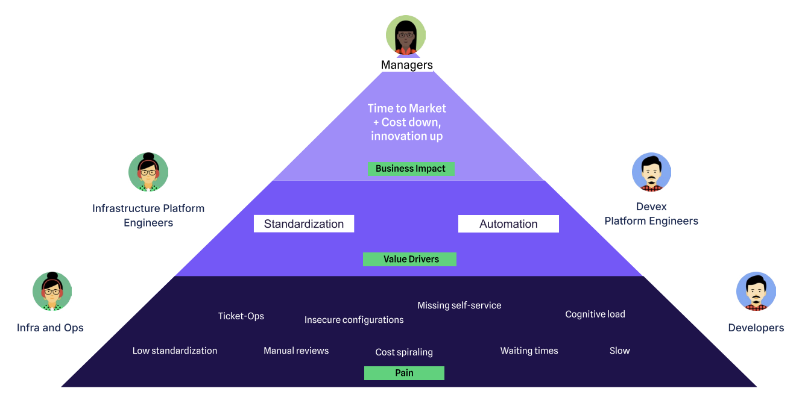
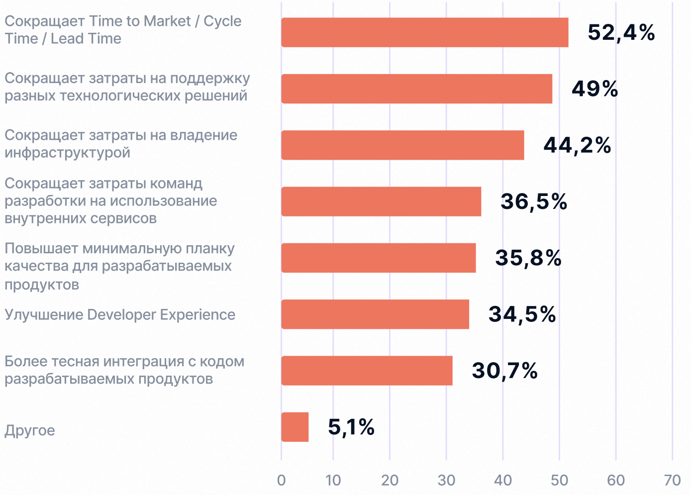
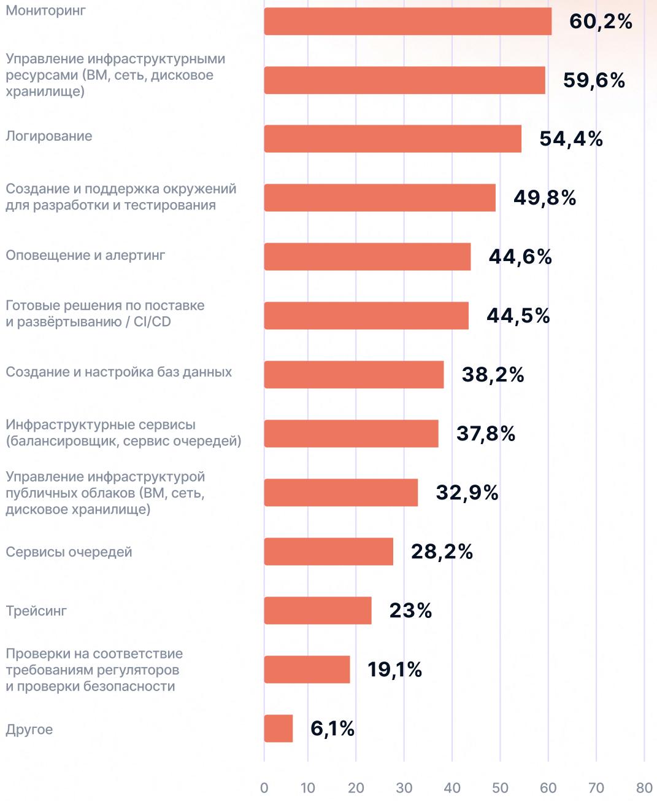
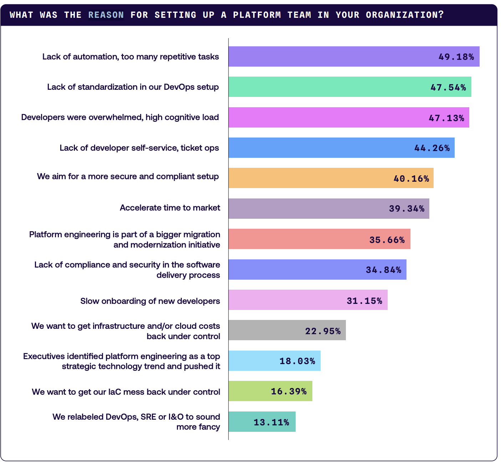

# Step 1. Определите цели и требования платформы

## Почему это важно?
Потому что 80% провалов в Platform Engineering начинаются с нечетких требований.

Вы можете построить идеальную платформу (IDP), но если она не решает реальные боли бизнеса или разработчиков — её просто не будут использовать.

---  

---  
## Ценность IDP. На основе опросов.
### State of Devops Russian 2024 (РФ):
> В чем вы видите ценность IDP?

---  
> Какие сервисы и услуги предоставляет вам внутренняя платформа IDP?

---  

### State of Platform Engineering 2024:

*Стандартизация и автоматизация основной драйвер по версии State of Platform Engineering 2024*

---  

## Топ-3 плохих целей для IDP

#### **1. «Сделать платформу для всех возможных сценариев»**  
❌ **Почему плохо:**  
- 80% команд используют только 20% функционала  
- Чем сложнее IDP, тем меньше её adoption  
- IDP должна **упрощать**, а не переизобретать Kubernetes, Terraform или CI/CD 

✅ **Как лучше:**  
*«Решить 3 ключевые боли разработчиков, остальное — через расширения»*  

#### **2. «Полностью исключить DevOps-инженеров из процессов»**  
❌ **Почему плохо:**  
- IDP не заменяет экспертизу, а делегирует рутину  
- Без обратной связи от DevOps платформа быстро устареет  

✅ **Как лучше:**  
*«Автоматизировать 90% рутинных задач, оставив сложные кейсы специалистам»*  

#### **3. «Внедрить все лучшие практики сразу»**  
❌ **Проблемы:**  
- GitOps, Observability, Policy-as-Code — это постепенные этапы  
- Попытка сделать всё сразу приводит к half-baked решениям  

✅ **Как лучше:**  
*«Начать с базового деплоя, затем поэтапно добавлять security и compliance»*  

---  
